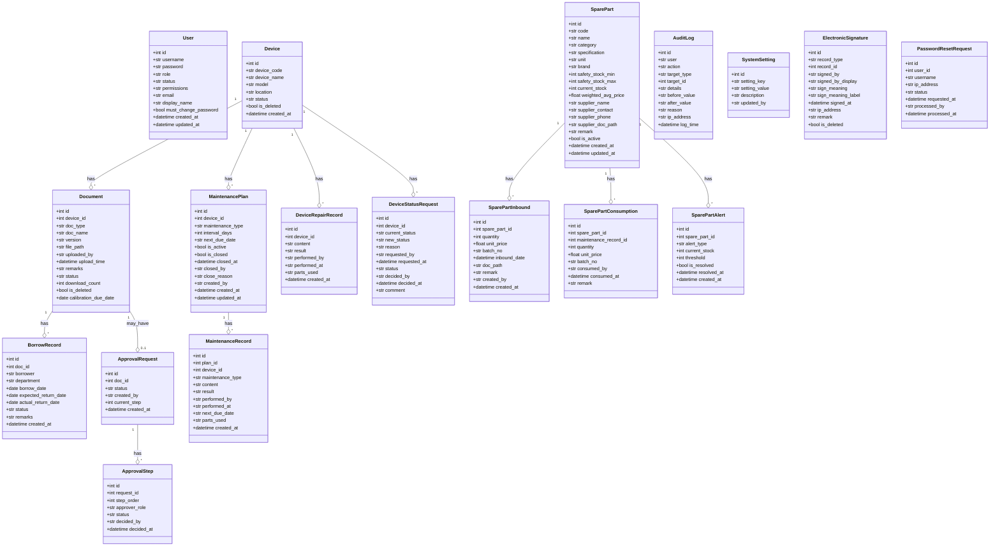
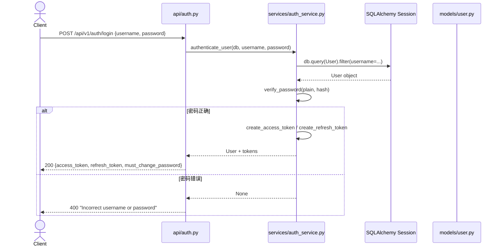
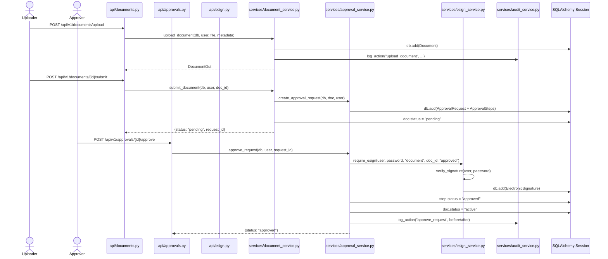
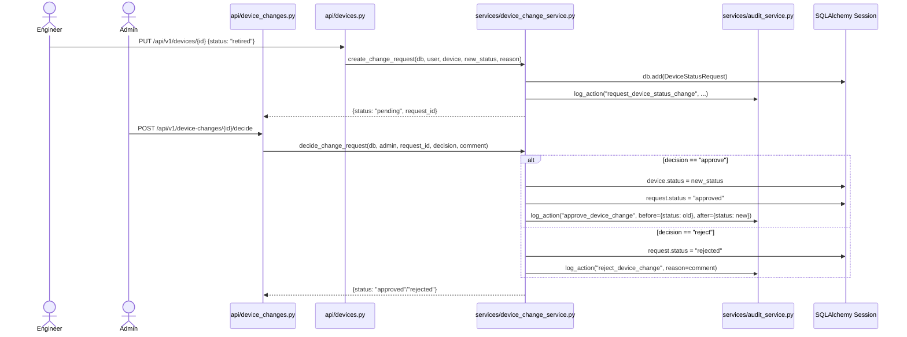
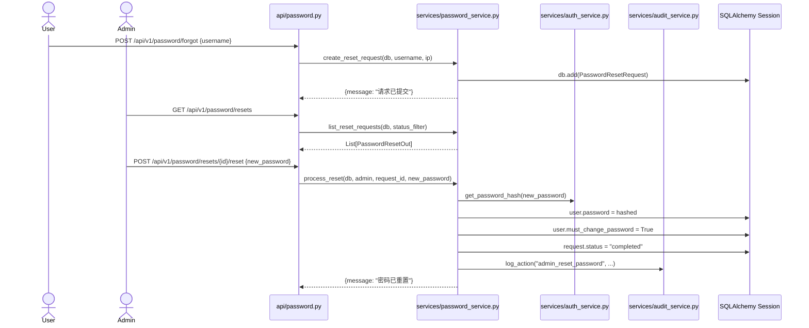
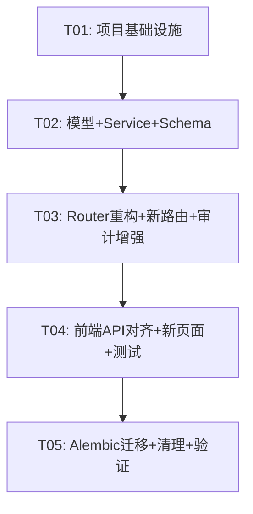

# DMS 设备管理系统 — 渐进式重构架构设计

> 文档版本：v1.0 | 日期：2026-06-08 | 架构师：高见远（Gao）

---

## 目录

1. [实现方案与框架选型](#1-实现方案与框架选型)
2. [文件列表及相对路径](#2-文件列表及相对路径)
3. [数据结构与接口（类图）](#3-数据结构与接口类图)
4. [程序调用流程（时序图）](#4-程序调用流程时序图)
5. [任务列表](#5-任务列表)
6. [依赖包列表](#6-依赖包列表)
7. [共享知识（跨文件约定）](#7-共享知识跨文件约定)
8. [待明确事项](#8-待明确事项)

---

## 1. 实现方案与框架选型

### 1.1 核心技术挑战

| 挑战 | 说明 | 应对策略 |
|------|------|---------|
| 手写 SQL 消除 | 现有 Flask 代码大量使用原生 SQL（`database.py` 1400+ 行），需全部替换为 SQLAlchemy ORM | 逐模块迁移，Service 层封装所有数据访问 |
| 鉴权统一 | 现有 `deps.py` 仅有 `get_current_user` 和 `require_admin`，缺少 RBAC 细粒度控制 | 实现 `require_role` 依赖注入 + 中间件权限校验 |
| 电子签名合规 | 21 CFR Part 11 要求签名不可篡改、防代签、失败锁定 | 将 Flask 逻辑完整迁移为 ORM + Service，保留锁定表机制 |
| 审计值变更 | 现有 `AuditLog` 模型有 `before_value`/`after_value` 字段但中间件未自动填充 | 实现变更值审计中间件，自动对比 before/after |
| SQLite/MySQL 双轨 | `database.py` 运行时检测数据库类型，两套 SQL 占位符 | 统一 MySQL，移除 SQLite 兼容层 |
| 密码安全 | 旧代码有硬编码默认密码 | 随机生成初始密码 + `must_change_password` 字段 |

### 1.2 技术栈确认

| 层次 | 技术 | 版本 | 说明 |
|------|------|------|------|
| **后端框架** | FastAPI | ^0.111.0 | 已在 `backend/` 中使用 |
| **ORM** | SQLAlchemy | ^2.0 | 已使用 declarative_base，需升级为 Mapped 风格 |
| **数据库迁移** | Alembic | ^1.13 | 已有 `alembic/` 目录，需完善 env.py |
| **数据库** | MySQL 8.0 | - | 统一移除 SQLite 支持 |
| **数据验证** | Pydantic v2 | ^2.7 | 已在 schemas 中使用 |
| **认证** | python-jose + passlib | ^3.3 / ^1.7 | JWT + bcrypt/pbkdf2 |
| **前端框架** | Vue 3 | ^3.3 | 已有基础代码 |
| **UI 库** | Element Plus | ^2.3 | 已使用 |
| **构建工具** | Vite | ^5.0 | 已配置 |
| **HTTP 客户端** | Axios | ^1.4 | 已使用 |

### 1.3 分层架构设计

```
┌─────────────────────────────────────────────────────┐
│                    API Layer (Router)                │
│  接收请求、参数校验、调用 Service、返回响应            │
├─────────────────────────────────────────────────────┤
│                  Service Layer                       │
│  业务逻辑、事务管理、跨 Model 协调、审计日志调用       │
├─────────────────────────────────────────────────────┤
│                  Model Layer (ORM)                   │
│  SQLAlchemy 模型定义、关系映射、字段约束               │
├─────────────────────────────────────────────────────┤
│               Infrastructure Layer                   │
│  DB Session、Config、Middleware、Dependencies         │
└─────────────────────────────────────────────────────┘
```

**关键约定**：
- Router 层不直接操作 `db.query()`，通过 Service 层间接访问
- Service 层负责事务边界（`db.commit()` / `db.rollback()`）
- Model 层仅定义数据结构和关系，不含业务逻辑
- 所有手写 SQL 必须替换为 ORM 操作

### 1.4 项目目录结构（基于现有 `backend/` 扩展）

```
backend/
├── app/
│   ├── __init__.py
│   ├── main.py                    # FastAPI 应用入口（需重构）
│   ├── api/                       # Router 层
│   │   ├── __init__.py
│   │   ├── deps.py                # 依赖注入（需增强 RBAC）
│   │   ├── auth.py                # 认证路由（已有，需调整）
│   │   ├── users.py               # 用户管理路由（已有，需调整）
│   │   ├── devices.py             # 设备路由（已有，需重构至 Service）
│   │   ├── documents.py           # 文档路由（已有，需重构至 Service）
│   │   ├── approvals.py           # 审批路由（已有，需重构至 Service）
│   │   ├── maintenance.py         # 维护路由（已有，需重构至 Service）
│   │   ├── spare_parts.py         # 备件路由（已有，需重构至 Service）
│   │   ├── borrowing.py           # 借阅路由（已有，需重构至 Service）
│   │   ├── audit.py               # 审计/设置/搜索路由（已有，需拆分）
│   │   ├── esign.py               # 电子签名路由（★ 新增）
│   │   ├── device_changes.py      # 设备状态变更路由（★ 新增）
│   │   ├── dashboard.py           # 仪表盘路由（★ 新增）
│   │   └── password.py            # 密码重置路由（★ 新增）
│   ├── core/                      # 核心配置
│   │   ├── __init__.py
│   │   ├── config.py              # 配置类（需增强 MySQL 连接池）
│   │   ├── security.py            # 安全工具（★ 新增，从 auth_service 提取）
│   │   └── permissions.py         # RBAC 权限定义（★ 新增）
│   ├── db/
│   │   ├── __init__.py
│   │   └── session.py             # 数据库会话（需增强 MySQL 连接池）
│   ├── middleware/
│   │   ├── __init__.py
│   │   ├── audit.py               # 审计中间件（已有，需增强）
│   │   └── rbac.py                # RBAC 权限中间件（★ 新增）
│   ├── models/                    # ORM 模型层
│   │   ├── __init__.py            # 需导入所有模型供 Alembic 发现
│   │   ├── user.py                # 用户模型（已有，需增强字段）
│   │   ├── device.py              # 设备模型（已有）
│   │   ├── document.py            # 文档模型（已有）
│   │   ├── approval.py            # 审批模型（已有）
│   │   ├── maintenance.py         # 维护模型（已有）
│   │   ├── spare_part.py          # 备件模型（已有）
│   │   ├── borrowing.py           # 借阅模型（已有）
│   │   ├── audit.py               # 审计/设置模型（已有）
│   │   ├── esign.py               # 电子签名模型（★ 新增）
│   │   ├── device_change.py       # 设备状态变更请求模型（★ 新增）
│   │   └── password_reset.py      # 密码重置请求模型（★ 新增）
│   ├── schemas/                   # Pydantic Schema 层
│   │   ├── __init__.py
│   │   ├── auth.py                # 已有（需增强）
│   │   ├── device.py              # 已有
│   │   ├── document.py            # 已有
│   │   ├── borrowing.py           # 已有
│   │   ├── maintenance.py         # 已有
│   │   ├── spare_part.py          # 已有
│   │   ├── audit.py               # 已有
│   │   ├── approval.py            # 审批 Schema（★ 新增）
│   │   ├── esign.py               # 电子签名 Schema（★ 新增）
│   │   ├── device_change.py       # 设备变更 Schema（★ 新增）
│   │   ├── search.py              # 搜索 Schema（★ 新增）
│   │   ├── settings.py            # 设置 Schema（★ 从 audit.py 拆分）
│   │   ├── dashboard.py           # 仪表盘 Schema（★ 新增）
│   │   ├── password.py            # 密码重置 Schema（★ 新增）
│   │   └── user.py                # 用户 Schema（★ 新增）
│   └── services/                  # Service 层
│       ├── __init__.py
│       ├── auth_service.py        # 已有（需增强）
│       ├── user_service.py        # 用户服务（★ 新增）
│       ├── device_service.py      # 设备服务（★ 新增）
│       ├── document_service.py    # 文档服务（★ 新增）
│       ├── approval_service.py    # 审批服务（★ 新增）
│       ├── maintenance_service.py # 维护服务（★ 新增）
│       ├── spare_part_service.py  # 备件服务（★ 新增）
│       ├── borrowing_service.py   # 借阅服务（★ 新增）
│       ├── audit_service.py       # 审计服务（★ 新增）
│       ├── esign_service.py       # 电子签名服务（★ 新增）
│       ├── device_change_service.py # 设备变更服务（★ 新增）
│       ├── dashboard_service.py   # 仪表盘服务（★ 新增）
│       ├── password_service.py    # 密码重置服务（★ 新增）
│       ├── search_service.py      # 搜索服务（★ 新增）
│       └── settings_service.py    # 设置服务（★ 新增）
├── tests/
│   ├── conftest.py                # 测试配置（★ 新增）
│   ├── test_auth.py               # 认证测试（★ 新增）
│   ├── test_devices.py            # 设备测试（★ 新增）
│   ├── test_documents.py          # 文档测试（★ 新增）
│   ├── test_esign.py              # 电子签名测试（★ 新增）
│   ├── test_rbac.py               # RBAC 测试（★ 新增）
│   └── ...
└── __init__.py
```

---

## 2. 文件列表及相对路径

### 2.1 需修改的现有文件

| 文件路径 | 职责 | 变更内容 |
|---------|------|---------|
| `backend/app/main.py` | FastAPI 应用入口 | 移除 legacy 兼容代码，注册新路由，添加 RBAC 中间件 |
| `backend/app/core/config.py` | 应用配置 | 移除 SQLite 支持，增加 MySQL 连接池配置、密码策略配置 |
| `backend/app/db/session.py` | 数据库会话 | 统一 MySQL 连接池，移除 SQLite 分支 |
| `backend/app/models/__init__.py` | 模型包初始化 | 导入所有模型以供 Alembic 发现 |
| `backend/app/models/user.py` | 用户模型 | 增加 `must_change_password`、`email`、`display_name` 字段 |
| `backend/app/models/audit.py` | 审计/设置模型 | 增强审计字段类型 |
| `backend/app/api/deps.py` | 依赖注入 | 增加 `require_role()` 通用 RBAC 依赖 |
| `backend/app/api/auth.py` | 认证路由 | 调用 Service 层，支持首次登录强制改密 |
| `backend/app/api/users.py` | 用户管理路由 | 调用 Service 层，随机密码生成 |
| `backend/app/api/devices.py` | 设备路由 | 移除内联 DB 操作，调用 device_service |
| `backend/app/api/documents.py` | 文档路由 | 移除内联 DB 操作和 legacy import，调用 document_service |
| `backend/app/api/approvals.py` | 审批路由 | 移除内联 DB 操作，调用 approval_service |
| `backend/app/api/maintenance.py` | 维护路由 | 移除内联 DB 操作和 legacy import，调用 maintenance_service |
| `backend/app/api/spare_parts.py` | 备件路由 | 移除内联 DB 操作，调用 spare_part_service |
| `backend/app/api/borrowing.py` | 借阅路由 | 移除内联 DB 操作，调用 borrowing_service |
| `backend/app/api/audit.py` | 审计/设置/搜索路由 | 拆分为独立路由模块 |
| `backend/app/middleware/audit.py` | 审计中间件 | 增强为变更值审计，自动记录 before/after |
| `backend/app/schemas/auth.py` | 认证 Schema | 增加 `must_change_password` 返回字段 |
| `backend/app/services/auth_service.py` | 认证服务 | 增强密码策略，移除 werkzeug 依赖改用 passlib |
| `alembic/env.py` | Alembic 迁移配置 | 导入所有新模型 |

### 2.2 需新建的文件

| 文件路径 | 职责 |
|---------|------|
| `backend/app/models/esign.py` | ElectronicSignature ORM 模型 |
| `backend/app/models/device_change.py` | DeviceStatusRequest ORM 模型 |
| `backend/app/models/password_reset.py` | PasswordResetRequest ORM 模型 |
| `backend/app/schemas/approval.py` | 审批 Pydantic Schema |
| `backend/app/schemas/esign.py` | 电子签名 Pydantic Schema |
| `backend/app/schemas/device_change.py` | 设备变更 Pydantic Schema |
| `backend/app/schemas/search.py` | 搜索 Pydantic Schema |
| `backend/app/schemas/settings.py` | 设置 Pydantic Schema（从 audit.py 迁出） |
| `backend/app/schemas/dashboard.py` | 仪表盘 Pydantic Schema |
| `backend/app/schemas/password.py` | 密码重置 Pydantic Schema |
| `backend/app/schemas/user.py` | 用户 Pydantic Schema |
| `backend/app/api/esign.py` | 电子签名 API 路由 |
| `backend/app/api/device_changes.py` | 设备状态变更 API 路由 |
| `backend/app/api/dashboard.py` | 仪表盘 API 路由 |
| `backend/app/api/password.py` | 密码重置 API 路由 |
| `backend/app/core/security.py` | 安全工具（密码哈希、JWT 解码） |
| `backend/app/core/permissions.py` | RBAC 权限定义与校验 |
| `backend/app/middleware/rbac.py` | RBAC 权限中间件 |
| `backend/app/services/user_service.py` | 用户管理服务 |
| `backend/app/services/device_service.py` | 设备管理服务 |
| `backend/app/services/document_service.py` | 文档管理服务 |
| `backend/app/services/approval_service.py` | 审批服务 |
| `backend/app/services/maintenance_service.py` | 维护管理服务 |
| `backend/app/services/spare_part_service.py` | 备件管理服务 |
| `backend/app/services/borrowing_service.py` | 借阅管理服务 |
| `backend/app/services/audit_service.py` | 审计日志服务 |
| `backend/app/services/esign_service.py` | 电子签名服务 |
| `backend/app/services/device_change_service.py` | 设备状态变更服务 |
| `backend/app/services/dashboard_service.py` | 仪表盘服务 |
| `backend/app/services/password_service.py` | 密码重置服务 |
| `backend/app/services/search_service.py` | 搜索服务 |
| `backend/app/services/settings_service.py` | 设置服务 |
| `backend/tests/conftest.py` | 测试配置与 fixtures |
| `backend/tests/test_auth.py` | 认证模块测试 |
| `backend/tests/test_devices.py` | 设备模块测试 |
| `backend/tests/test_rbac.py` | RBAC 权限测试 |

---

## 3. 数据结构与接口（类图）



### 3.1 新增模型详细定义

#### ElectronicSignature (`backend/app/models/esign.py`)

```python
class ElectronicSignature(Base):
    __tablename__ = "electronic_signatures"

    id = Column(Integer, primary_key=True, index=True)
    record_type = Column(String(64), nullable=False)     # maintenance_plan, document, device_change 等
    record_id = Column(Integer, nullable=False)
    signed_by = Column(String(128), nullable=False)       # 签名人用户名
    signed_by_display = Column(String(128), nullable=False) # 签名人显示名快照
    sign_meaning = Column(String(32), nullable=False)     # approved/reviewed/executed/released
    sign_meaning_label = Column(String(64), nullable=False) # 中文标签
    signed_at = Column(DateTime, server_default=func.current_timestamp())
    ip_address = Column(String(64), nullable=True)
    remark = Column(Text, nullable=True)
    is_deleted = Column(Boolean, default=False)

    # 签名锁定表
    __table_args__ = (
        Index('ix_esign_record', 'record_type', 'record_id'),
    )
```

#### DeviceStatusRequest (`backend/app/models/device_change.py`)

```python
class DeviceStatusRequest(Base):
    __tablename__ = "device_status_requests"

    id = Column(Integer, primary_key=True, index=True)
    device_id = Column(Integer, ForeignKey("devices.id"), nullable=False)
    current_status = Column(String(32), nullable=False)
    new_status = Column(String(32), nullable=False)
    reason = Column(Text, nullable=True)
    requested_by = Column(String(128), nullable=False)
    requested_at = Column(DateTime, server_default=func.current_timestamp())
    status = Column(String(32), default="pending")  # pending/approved/rejected
    decided_by = Column(String(128), nullable=True)
    decided_at = Column(DateTime, nullable=True)
    comment = Column(Text, nullable=True)
```

#### PasswordResetRequest (`backend/app/models/password_reset.py`)

```python
class PasswordResetRequest(Base):
    __tablename__ = "password_reset_requests"

    id = Column(Integer, primary_key=True, index=True)
    user_id = Column(Integer, ForeignKey("users.id"), nullable=False)
    username = Column(String(128), nullable=False)
    ip_address = Column(String(64), nullable=True)
    status = Column(String(32), default="pending")  # pending/completed/expired/cancelled
    requested_at = Column(DateTime, server_default=func.current_timestamp())
    processed_by = Column(String(128), nullable=True)
    processed_at = Column(DateTime, nullable=True)
```

### 3.2 User 模型增强字段

```python
# 在现有 User 模型中新增
email = Column(String(256), nullable=True)
display_name = Column(String(128), nullable=True)
must_change_password = Column(Boolean, default=False)
created_at = Column(DateTime, server_default=func.current_timestamp())
updated_at = Column(DateTime, server_default=func.current_timestamp(), onupdate=func.current_timestamp())
```

---

## 4. 程序调用流程（时序图）

### 4.1 登录认证流程



### 4.2 文档审批 + 电子签名流程



### 4.3 设备状态变更流程



### 4.4 密码重置流程



---

## 5. 任务列表

### Phase 1：基础设施（T01）

#### T01: 项目基础设施 — 配置、数据库连接、安全模块、RBAC 框架

- **任务ID**: T01
- **描述**: 建立重构所需的基础设施：统一 MySQL 连接池、完善配置管理、提取安全工具模块、建立 RBAC 权限框架、完善 Alembic 迁移配置、移除 SQLite 支持
- **涉及文件**:
  - `backend/app/core/config.py` — 增强 MySQL 连接池配置，移除 SQLite
  - `backend/app/db/session.py` — 统一 MySQL 连接池
  - `backend/app/core/security.py` — 新建，从 auth_service 提取密码哈希/JWT
  - `backend/app/core/permissions.py` — 新建，RBAC 权限定义
  - `backend/app/middleware/rbac.py` — 新建，RBAC 权限中间件
  - `backend/app/api/deps.py` — 增强 require_role() 通用 RBAC 依赖
  - `backend/app/models/__init__.py` — 导入所有模型
  - `alembic/env.py` — 导入新模型
  - `alembic.ini` — 更新数据库 URL 配置
- **依赖**: 无
- **优先级**: P0
- **预估复杂度**: L

---

### Phase 2：核心模块（T02、T03）

#### T02: 补齐缺失模型 + 全量 Service 层 + Schema 补齐

- **任务ID**: T02
- **描述**: 补齐缺失的 3 个 ORM 模型（ElectronicSignature, DeviceStatusRequest, PasswordResetRequest），增强 User 模型字段；为所有模块创建 Service 层，将 Router 层内联 DB 操作迁移到 Service；补齐所有缺失的 Pydantic Schema
- **涉及文件**:
  - `backend/app/models/esign.py` — 新建 ElectronicSignature 模型
  - `backend/app/models/device_change.py` — 新建 DeviceStatusRequest 模型
  - `backend/app/models/password_reset.py` — 新建 PasswordResetRequest 模型
  - `backend/app/models/user.py` — 增加 must_change_password 等字段
  - `backend/app/services/device_service.py` — 新建
  - `backend/app/services/document_service.py` — 新建
  - `backend/app/services/approval_service.py` — 新建
  - `backend/app/services/maintenance_service.py` — 新建
  - `backend/app/services/spare_part_service.py` — 新建
  - `backend/app/services/borrowing_service.py` — 新建
  - `backend/app/services/audit_service.py` — 新建
  - `backend/app/services/esign_service.py` — 新建
  - `backend/app/services/device_change_service.py` — 新建
  - `backend/app/services/dashboard_service.py` — 新建
  - `backend/app/services/password_service.py` — 新建
  - `backend/app/services/search_service.py` — 新建
  - `backend/app/services/settings_service.py` — 新建
  - `backend/app/services/user_service.py` — 新建
  - `backend/app/services/auth_service.py` — 重构，使用 passlib
  - `backend/app/schemas/approval.py` — 新建
  - `backend/app/schemas/esign.py` — 新建
  - `backend/app/schemas/device_change.py` — 新建
  - `backend/app/schemas/search.py` — 新建
  - `backend/app/schemas/settings.py` — 新建（从 audit.py 迁出）
  - `backend/app/schemas/dashboard.py` — 新建
  - `backend/app/schemas/password.py` — 新建
  - `backend/app/schemas/user.py` — 新建
  - `backend/app/schemas/auth.py` — 增强 must_change_password
- **依赖**: T01
- **优先级**: P0
- **预估复杂度**: L

#### T03: 全量 Router 重构 + 新路由补齐 + 审计中间件增强

- **任务ID**: T03
- **描述**: 将所有 Router 改为调用 Service 层（移除内联 DB 操作和 legacy import）；补齐缺失的 API 路由（esign, device_changes, dashboard, password）；增强审计中间件实现 before/after 值审计；完善 main.py 路由注册
- **涉及文件**:
  - `backend/app/api/auth.py` — 重构调用 Service
  - `backend/app/api/users.py` — 重构调用 Service
  - `backend/app/api/devices.py` — 重构调用 Service
  - `backend/app/api/documents.py` — 重构调用 Service，移除 legacy import
  - `backend/app/api/approvals.py` — 重构调用 Service，移除 legacy import
  - `backend/app/api/maintenance.py` — 重构调用 Service，移除 legacy import
  - `backend/app/api/spare_parts.py` — 重构调用 Service
  - `backend/app/api/borrowing.py` — 重构调用 Service
  - `backend/app/api/audit.py` — 重构/拆分
  - `backend/app/api/esign.py` — 新建
  - `backend/app/api/device_changes.py` — 新建
  - `backend/app/api/dashboard.py` — 新建
  - `backend/app/api/password.py` — 新建
  - `backend/app/middleware/audit.py` — 增强 before/after 审计
  - `backend/app/main.py` — 注册新路由和中间件，移除 legacy 兼容
- **依赖**: T02
- **优先级**: P0
- **预估复杂度**: L

---

### Phase 3：增强功能（T04）

#### T04: 前端 API 对齐 + 新页面 + 测试基础

- **任务ID**: T04
- **描述**: 补齐前端缺失的 API 模块和页面（ESign、Settings、Search、Dashboard、Approvals、Password）；为所有 API 添加统一 `/api/v1/{module}/` 前缀的调用；补齐前端路由；建立后端测试基础框架和核心测试用例
- **涉及文件**:
  - `frontend/src/api/esign.js` — 新建
  - `frontend/src/api/settings.js` — 新建
  - `frontend/src/api/search.js` — 新建
  - `frontend/src/api/dashboard.js` — 新建
  - `frontend/src/api/approvals.js` — 新建
  - `frontend/src/api/password.js` — 新建
  - `frontend/src/pages/ESign.vue` — 新建
  - `frontend/src/router/index.js` — 增加新路由
  - `backend/tests/conftest.py` — 新建
  - `backend/tests/test_auth.py` — 新建
  - `backend/tests/test_devices.py` — 新建
  - `backend/tests/test_esign.py` — 新建
  - `backend/tests/test_rbac.py` — 新建
- **依赖**: T03
- **优先级**: P1
- **预估复杂度**: M

---

### Phase 5：集成验收（T05）

#### T05: Alembic 迁移 + 清理遗留代码 + 端到端验证

- **任务ID**: T05
- **描述**: 生成完整的 Alembic 迁移脚本；清理所有 legacy Flask 代码引用（移除 `from database import`、`from utils.audit import`、`from config import` 兼容导入）；移除硬编码默认密码；端到端功能验证确保零回退
- **涉及文件**:
  - `alembic/versions/` — 新增迁移脚本
  - `backend/app/main.py` — 移除 legacy_init_db
  - 所有 Service 文件 — 确保无 legacy import 残留
  - `backend/app/core/config.py` — 确认无硬编码密码
  - `backend/tests/test_e2e.py` — 新建端到端测试
- **依赖**: T04
- **优先级**: P0
- **预估复杂度**: M

---

### 任务依赖图



---

## 6. 依赖包列表

### 6.1 Python 后端依赖

```
# 现有需保留
fastapi>=0.111.0
uvicorn[standard]>=0.30.0
sqlalchemy>=2.0.30
alembic>=1.13.0
pydantic>=2.7.0
python-jose[cryptography]>=3.3.0
python-dotenv>=1.0.0

# 新增/替换
passlib[bcrypt]>=1.7.4        # 替换 werkzeug.security 的密码哈希
pymysql>=1.1.0                # MySQL 驱动
cryptography>=42.0.0          # python-jose 和 passlib 依赖

# 需移除
# flask                        # 不再需要
# flask-login                  # 不再需要
# werkzeug                     # 不再需要（密码哈希改用 passlib）
# gunicorn                     # 改用 uvicorn
```

### 6.2 前端依赖

```json
{
  "dependencies": {
    "vue": "^3.3.4",
    "vue-router": "^4.1.6",
    "axios": "^1.4.0",
    "element-plus": "^2.3.10",
    "@element-plus/icons-vue": "^2.3.1",
    "qrcode.vue3": "^0.6.0",
    "xlsx": "^0.18.5"
  },
  "devDependencies": {
    "vite": "^5.0.0",
    "@vitejs/plugin-vue": "^4.0.0"
  }
}
```

---

## 7. 共享知识（跨文件约定）

### 7.1 API 响应格式规范

```python
# 统一成功响应
{"code": 0, "data": {...}, "message": "ok"}

# 统一错误响应
{"code": 40001, "data": null, "message": "错误描述"}

# 分页响应
{
    "code": 0,
    "data": {
        "items": [...],
        "total": 100,
        "page": 1,
        "page_size": 20,
        "pages": 5
    },
    "message": "ok"
}
```

> **注意**：现有 Router 返回的是裸数据（直接返回 ORM 对象/列表），为保持向后兼容性，本次重构不强制包装统一响应格式。如需统一，可作为后续优化项。现有格式保持：成功直接返回数据，失败抛出 HTTPException。

### 7.2 认证鉴权规范

- **Token 类型**: JWT (HS256)
- **Access Token 有效期**: 60 分钟（可配置）
- **Refresh Token 有效期**: 7 天（可配置）
- **Token 载荷**: `{"sub": "<user_id>", "role": "<role>", "type": "access|refresh", "exp": ...}`
- **鉴权方式**: `Authorization: Bearer <access_token>`
- **首次登录强制改密**: User.must_change_password == True 时，登录后所有非改密 API 返回 403

### 7.3 RBAC 权限规范

```python
# 角色定义（7 种）
ROLES = ["admin", "qa_manager", "equipment_engineer", "validation_engineer",
         "archivist", "production_supervisor", "metrology_engineer"]

# 依赖注入用法
@router.get("/admin-only", dependencies=[Depends(require_role("admin"))])
@router.get("/qa-or-admin", dependencies=[Depends(require_role("admin", "qa_manager"))])

# 中间件自动校验
# RBAC 中间件根据路由配置的权限要求自动校验用户角色
```

### 7.4 审计日志规范

```python
# 审计日志记录内容
audit_service.log_action(
    user=current_user.username,
    action="update_device",           # 格式: <verb>_<noun>
    target_type="device",             # 业务对象类型
    target_id=device.id,              # 业务对象 ID
    details="更新设备状态",            # 人类可读描述
    before_value={"status": "active"},# 变更前值（JSON 字符串）
    after_value={"status": "retired"},# 变更后值（JSON 字符串）
    reason="设备报废",                 # 变更原因（可选）
    ip_address=request.client.host,   # 客户端 IP
)
```

### 7.5 密码策略规范

- **初始密码**: 随机生成 12 位（含大小写字母+数字+特殊字符）
- **密码哈希**: passlib bcrypt（兼容旧数据 werkzeug pbkdf2:sha256，验证时自动检测格式）
- **密码策略**: 最少 8 位，必须含大小写字母和数字
- **首次登录强制修改**: must_change_password 字段控制
- **禁止硬编码默认密码**: 所有新建用户必须使用随机密码

### 7.6 API 路由前缀规范

```
/api/v1/auth/           # 认证
/api/v1/users/          # 用户管理
/api/v1/devices/        # 设备管理
/api/v1/documents/      # 文档管理
/api/v1/approvals/      # 审批管理
/api/v1/maintenance/    # 维护管理（含 plans, records, repair-records）
/api/v1/spare-parts/    # 备件管理
/api/v1/borrowing/      # 借阅管理
/api/v1/esign/          # 电子签名
/api/v1/device-changes/ # 设备状态变更
/api/v1/dashboard/      # 仪表盘
/api/v1/password/       # 密码重置
/api/v1/audit-logs/     # 审计日志
/api/v1/settings/       # 系统设置
/api/v1/search/         # 全局搜索
```

### 7.7 Service 层编码约定

```python
# 每个 Service 方法签名
def some_operation(db: Session, current_user: User, ...) -> SomeModel:
    """
    1. 参数校验（业务规则）
    2. 数据查询
    3. 业务逻辑处理
    4. 数据持久化（db.commit 在 service 层）
    5. 审计日志记录
    6. 返回结果
    """
    pass

# 异常处理
# Service 层抛出 ValueError / PermissionError / NotFoundError
# Router 层捕获并转换为 HTTPException
```

---

## 8. 待明确事项

| # | 事项 | 当前假设 | 影响范围 |
|---|------|---------|---------|
| 1 | **esign_lockouts 表迁移** | 假设迁移到 ORM 模型，创建 ESigLockout 模型。也可考虑用 Redis 等内存方案 | esign_service, alembic |
| 2 | **密码兼容策略** | 假设 passlib bcrypt 可以验证旧的 werkzeug pbkdf2:sha256 哈希。若不行，需保留 werkzeug 作为验证回退 | auth_service, core/security |
| 3 | **前端 ESign 页面交互** | 假设为弹窗式签名（输入用户名+密码），需与审批/维护等操作联动 | esign.vue, 前端各业务页面 |
| 4 | **Dashboard 统计接口性能** | 现有 Flask dashboard 有多表联查+聚合，ORM 版本可能需要优化查询 | dashboard_service |
| 5 | **文件上传路径** | 当前使用项目根目录下的 `uploads/`，需确认是否保持或改为配置化 | document_service, config |
| 6 | **审计中间件 before/after 自动捕获** | 通过 SQLAlchemy event 监听 `before_flush` / `after_flush` 实现，还是手动在每个 Service 方法中记录 | middleware/audit, 所有 Service |
| 7 | **旧 signatures 表处理** | PRD 确认移除旧版 signatures，但需确认是否保留数据迁移或直接废弃 | alembic migration |
| 8 | **跨域配置** | 当前硬编码 localhost:5173/3000，需确认生产环境的 CORS 域名 | main.py |

---

> **文档结束** — 本架构设计基于 2026-06-08 日项目代码实际状态撰写，所有文件路径和模型定义均来源于对现有代码的阅读分析。
